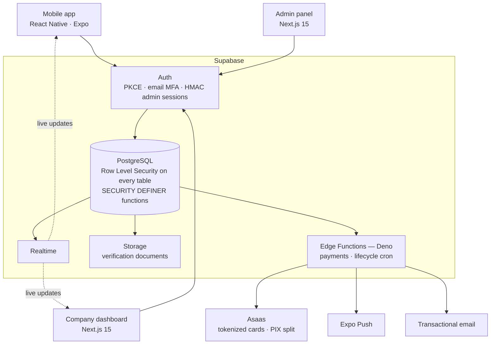
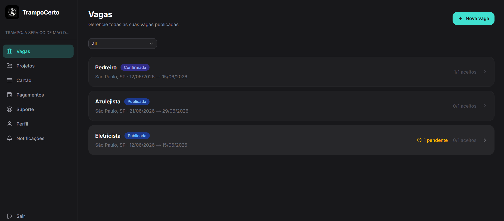
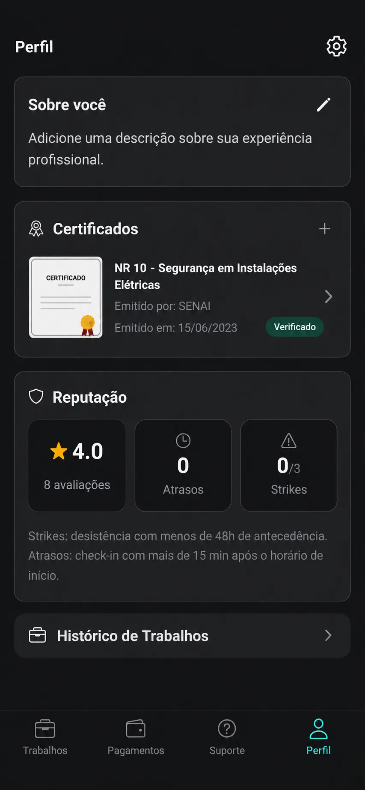
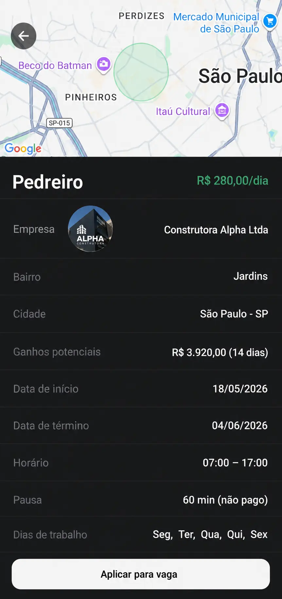
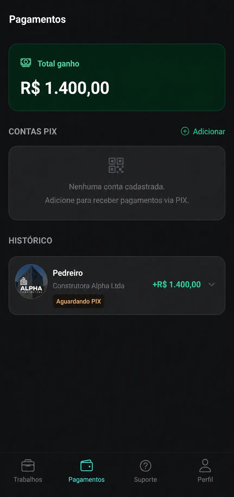
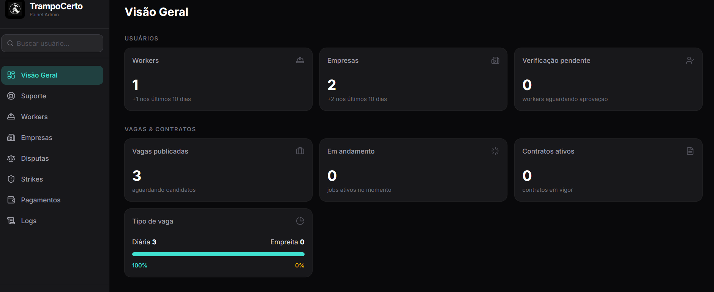

# TrampoCerto

**A full-stack mobile marketplace connecting construction workers with companies that need to hire fast.**

<!-- Quando as lojas estiverem públicas, transforme os dois badges abaixo em links:
     
      -->

[**trampocertoapp.com**](https://www.trampocertoapp.com/)

> **Note:** This is a public showcase of a private, production project. The source code is closed — this page documents the architecture, features and engineering decisions behind it.

---

## The problem

Hiring in Brazilian construction runs on phone calls and word of mouth. A company that loses a bricklayer on Monday needs a replacement on Tuesday, and finds one by asking around.

Nobody can verify whether the person has actually done the work before. Nobody keeps a record of who showed up on which day. And on both sides of the deal, getting paid comes down to trust — the worker trusts the company will pay at the end of the week, the company trusts the worker will come back tomorrow.

**TrampoCerto turns that cycle into a system:** verified profiles, jobs filtered by trade and distance, daily attendance confirmed by both parties, and payment executed by the platform instead of promised between strangers.

Almost every architectural decision in this project traces back to that last sentence. When money and reputation are on the line, the rules cannot live in the client.

## What it is

A two-sided marketplace for the construction industry.

**Workers** — bricklayers, helpers, electricians, plumbers — create a profile, get their documents verified and apply to jobs near them. **Companies** post jobs, hire, track daily attendance and pay automatically.

The product spans a **mobile app** (iOS and Android), a **web dashboard** for companies and an **admin panel** for operations, all on a single shared backend.

**Status:** in production, available on the App Store and Google Play.

## Architecture

Three clients, one backend, zero duplicated business rules.

The shape of this diagram is the point: **the clients talk to the database, and the database enforces the rules.** There is no application server in the middle deciding who may do what — because a rule that lives in a server can be bypassed by a client that simply stops calling it.

## Screenshots

**Company dashboard**

  

**Mobile app** — worker profile, job feed, job detail

  
  
  

**Admin panel**

  

## Tech stack

| Layer | Technology |
|---|---|
| **Mobile** | React Native, Expo, Expo Router, NativeWind |
| **Web** | Next.js 15 (App Router), Tailwind CSS, shadcn/ui |
| **Language** | TypeScript, end to end |
| **Backend** | Supabase — PostgreSQL, Auth, Storage, Realtime |
| **Serverless** | Supabase Edge Functions (Deno) |
| **Payments** | Asaas — marketplace split, tokenized cards, PIX |
| **Infra** | Vercel, Cloudflare (WAF + DNS), EAS Build |

## Features

### For workers
- Profile with trades, availability, location radius and document verification
- Job feed filtered by distance and skills, with real-time application status
- Daily work log — attendance and activities — plus contract extensions
- Payment history and PIX payout accounts
- Ratings and reputation

### For companies
- Post and manage jobs, either daily-rate or fixed-price contracts
- Review applicants, accept or reject, rate workers
- Daily attendance control with a confirm/dispute flow
- Tokenized card on file, automatic billing
- Reputation and payment history

### Platform
- **Real-time** updates between both sides via Supabase Realtime
- **Push notifications** (Expo Push) triggered directly from the database
- Transactional **emails** for critical events
- **Admin panel** — user and document verification, disputes, support tickets, audit log

## Architecture highlights

- **End-to-end TypeScript** across 85+ screens: mobile app, web dashboard and admin panel.
- **Security-first data layer.** Row Level Security on every table; business logic enforced inside the database through `SECURITY DEFINER` functions. Clients never trust their own IDs — every critical action is authorized server-side.
- **Marketplace payment model.** The platform never holds funds. Cards are tokenized server-side, companies are charged automatically, and workers receive PIX transfers directly, driven by Edge Functions and scheduled cron jobs: weekly capture, fixed-price midpoint and completion charges.
- **Automated lifecycle.** Job confirmation, auto-close, contract extensions, completion disputes and worker-removal flows all run on scheduled jobs, rather than on someone remembering to click a button.
- **Hardened auth.** PKCE flow, email-based MFA for companies, HMAC-signed admin sessions, privilege-escalation guards, and a Cloudflare WAF in front of everything.

## Engineering decisions

**Logic in the database, not in the client.** Accepting a job, charging a card and deleting an account run as atomic Postgres functions. A tampered client cannot bypass a rule that lives below it, and both frontends stay thin because neither owns any business rule.

**RLS as the default, not an afterthought.** Every new table ships with Row Level Security enabled. Isolation between companies and workers is enforced at the lowest layer available, so a mistake in a single query cannot leak another company's data.

**Server-side card tokenization.** No raw card data ever touches the app. The mobile client opens a payment link and the token comes back through a webhook, which keeps the app out of payment card scope entirely.

**One backend, three clients.** The mobile app, the company dashboard and the admin panel consume the same Supabase project. Three copies of a business rule are three chances for them to disagree — and in a product that moves money, disagreement is a bug with a price tag.

---

Built end to end by **Tiago Guerra Endsfeldz** — data modeling, backend, mobile app, web dashboard, payments and deployment.

[LinkedIn](https://www.linkedin.com/in/tiago-guerra-endsfeldz/) · [trampocertoapp.com](https://www.trampocertoapp.com/) · tiago.guerrae@gmail.com

